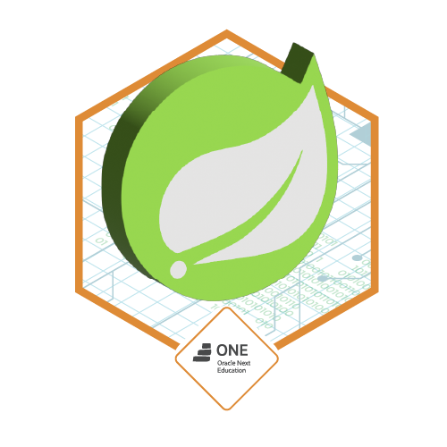

<div align="center">
  <h1>FórumHub API</h1>
</div>

<p align="center">
  
  
  
  
</p>

<h4 align="center">
  API REST desenvolvida como parte do Challenge Alura + Oracle (ONE), com o objetivo de criar um sistema de fórum para gerenciamento de tópicos, implementando CRUD completo e autenticação JWT com Spring Security.
</h4>

<p align="center">
  
</p>

## 📜 Índice

-   [Sobre o Projeto](#-sobre-o-projeto)
-   [Funcionalidades](#-funcionalidades)
-   [Tecnologias Utilizadas](#-tecnologias-utilizadas)
-   [Pré-requisitos](#-pré-requisitos)
-   [Como Executar](#-como-executar)
-   [Endpoints da API](#-endpoints-da-api)
-   [Autor](#-autor)

## 📖 Sobre o Projeto

**FórumHub** é uma API REST para um fórum online, onde usuários autenticados podem criar, ler, atualizar e deletar tópicos de discussão. O sistema foi construído em Java com o ecossistema Spring, focando em boas práticas de desenvolvimento de APIs, como a implementação de um sistema de autenticação e autorização seguro para proteger os endpoints.

## ✨ Funcionalidades

-   ✅ **CRUD de Tópicos:** Criação, listagem, detalhamento, atualização e exclusão de tópicos.
-   🔐 **Autenticação e Autorização:** Controle de acesso via Spring Security e tokens JWT, garantindo que apenas usuários autenticados possam modificar os dados.
-   📄 **Validações:** Regras de negócio aplicadas na camada de serviço para garantir a integridade dos dados.
-   📚 **Documentação com Swagger:** Todos os endpoints são documentados e podem ser testados de forma interativa através da interface do Swagger.

## 🚀 Tecnologias Utilizadas

-   **Java 17**
-   **Spring Framework**:
    -   `Spring Boot`: Para simplificar a configuração e o desenvolvimento.
    -   `Spring Web`: Para a criação de endpoints REST.
    -   `Spring Data JPA`: Para a persistência de dados.
    -   `Spring Security`: Para a camada de segurança.
-   **JWT (JSON Web Token)**: Para a geração de tokens de autenticação.
-   **MySQL**: Banco de dados relacional para persistência dos dados.
-   **Maven**: Gerenciador de dependências e build do projeto.
-   **Swagger/OpenAPI**: Para documentação interativa da API.

## ⚙️ Pré-requisitos

-   **Java 17** ou superior.
-   **Maven 3.8** ou superior.
-   **MySQL** instalado e em execução.

## ▶️ Como Executar

1.  **Clone o repositório:**
    ```bash
    git clone [https://github.com/seu-usuario/forumhub.git](https://github.com/seu-usuario/forumhub.git)
    ```

2.  **Navegue até o diretório do projeto:**
    ```bash
    cd forumhub
    ```

3.  **Configure o banco de dados:**
    -   Crie um banco de dados no MySQL chamado `forumhub_db`.
    -   Atualize o arquivo `src/main/resources/application.properties` com suas credenciais do MySQL:
        ```properties
        spring.datasource.url=jdbc:mysql://localhost:3306/forumhub_db
        spring.datasource.username=SEU_USUARIO_AQUI
        spring.datasource.password=SUA_SENHA_AQUI
        ```

4.  **Execute a aplicação:**
    ```bash
    mvn spring-boot:run
    ```

5.  **Acesse a documentação Swagger** para explorar e testar os endpoints:
    [http://localhost:8080/swagger-ui/index.html](http://localhost:8080/swagger-ui/index.html)

## 📡 Endpoints da API

### Autenticação

-   `POST /auth/login`
    -   Realiza o login de um usuário e retorna um token JWT para ser usado nas requisições seguintes.

    

### Tópicos

-   `GET /topicos`: Lista todos os tópicos.
-   `GET /topicos/{id}`: Busca um tópico específico pelo ID.
-   `POST /topicos`: Cria um novo tópico (requer autenticação).
-   `PUT /topicos/{id}`: Atualiza um tópico existente (requer autenticação).
-   `DELETE /topicos/{id}`: Deleta um tópico (requer autenticação).


## 👨‍💻 Autor
Contato: `wesneipaiva@gmail.com` 
